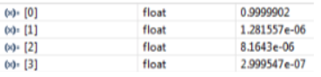
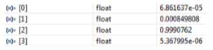
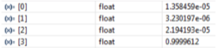

# Vowel Recognition with Neural Network

## Overview
This project identifies spoken vowel sounds ("ah", "ee", "oo", "eh") from a microphone input.  
The goal is to understand the basics behind technologies like Amazon Alexa and other voice recognition systems.

The program was developed in **Code Composer Studio (CCS)** for the **TI L138/C6748 Development Kit (LCDK)**, a single-core DSP platform designed for low-power applications in biometrics, audio, analytics, and communications.

---

## Approach
1. **Data Collection:** Recorded each vowel sound 10 times.  
2. **Neural Network Training:** Used MATLAB’s Neural Network feature to train on the recordings and generate parameters for classification.  
3. **DSP Implementation:** Programmed the trained parameters into the LCDK to classify live microphone input.  
4. **Output:** The program returns a four-element array corresponding to the probability of each vowel. The highest value indicates the predicted vowel.

---

## Example Output
- Input: `"ah"` → `[0.99, 0.01, 0.00, 0.00]` → 99% confidence for "ah"  
- Input: `"ee"` → `[0.00, 0.01, 0.99, 0.00]` → 99% confidence for "ee"  
- Input: `"oo"` → `[0.00, 0.00, 0.01, 0.99]` → 99% confidence for "oo"  

---

## Tools & Environment
- **IDE:** Code Composer Studio (CCS)  
- **Hardware:** TI L138/C6748 LCDK  
- **Languages:** C for embedded DSP, MATLAB for neural network training  

---

## Key Learnings
- Basics of speech recognition and neural network implementation  
- Using MATLAB to generate parameters for embedded systems  
- Implementing machine learning models on DSP hardware  
